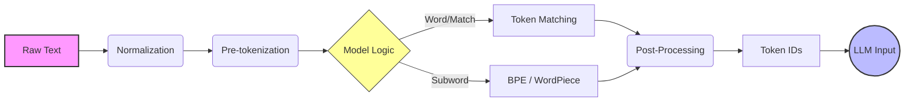

# Tokenizers from Scratch

This module explores the fundamental building blocks of Large Language Models (LLMs): **Tokenizers**. It covers the implementation of tokenizers from scratch, as well as the usage of industry-standard libraries like Google's SentencePiece and Hugging Face's `tokenizers`.

## 📂 Content

The main notebook `tokenizers.ipynb` covers the following topics:

1.  **Custom Tokenizer**: Implementing a simple word-based tokenizer using a manual vocabulary in Python.
2.  **SentencePiece**: Training a subword tokenizer (BPE) using the SentencePiece library.
3.  **Hugging Face Tokenizers**: Training and using a Byte-Pair Encoding (BPE) tokenizer with the optimized `tokenizers` library.
4.  **Hub Integration**: Uploading the trained tokenizer to the Hugging Face Hub.

## 🔄 Tokenization Workflow

The following diagram illustrates the typical workflow of a tokenizer in an LLM pipeline:



## 🛠️ Usage

To run the notebook:

1.  Ensure you have the required dependencies installed:
    ```bash
    pip install sentencepiece tokenizers transformers huggingface_hub
    ```
2.  Open `tokenizers.ipynb` in a Jupyter environment.
