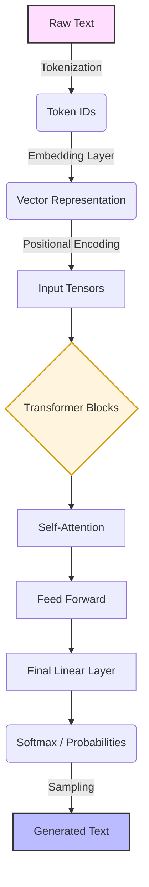

# 🧠 LLM from Scratch: A Journey into Deep Learning

Welcome to the **LLM from Scratch** repository! This project is a hands-on exploration of the architectures and algorithms behind modern Large Language Models (LLMs). Follow along as we build, train, and understand every component of a transformer-based model.

---

## 🚀 Project Roadmap

Here is the step-by-step journey we are taking to build a powerful LLM from the ground up.

| Stage | Module | Description | Status |
| :--- | :--- | :--- | :--- |
| 1️⃣ | [**Tokenizers**](./1_tokenizers) | Converting raw text into numerical data using BPE, SentencePiece, etc. | ✅ Completed |
| 2️⃣ | **Embeddings** | Mapping tokens to high-dimensional vector spaces. | ⏳ To Do |
| 3️⃣ | **Self-Attention** | Building the core "Attention" mechanism. | ⏳ To Do |
| 4️⃣ | **Transformer Blocks** | Assembling LayerNorm, FeedForward, and Residual connections. | ⏳ To Do |
| 5️⃣ | **Pre-training** | Training the model on massive datasets. | ⏳ To Do |

---

## 🛠️ Module Spotlight: Tokenization

The first hurdle in LLM development is teaching the machine how to "read". In this module, we implement:
- **Custom Python Tokenizers** from basic logic.
- **Byte-Pair Encoding (BPE)** for efficient subword handling.
- **Google's SentencePiece** integration.
- **Hugging Face Tokenizers** for optimized performance.

👉 **Explore the Module:** [1_tokenizers README](./1_tokenizers/README.md)  
👉 **Live Demo:** [Kaggle Notebook - Tokenizers from Scratch](https://www.kaggle.com/code/huseyincenik/tokenizers)

---

## 📊 LLM Pipeline Architecture

The following diagram represents the high-level flow of data from raw text to the model's output:

---

## 💻 Tech Stack

- **Languages:** Python 🐍
- **Deep Learning:** PyTorch / Transformers
- **Efficiency:** Hugging Face `tokenizers`, SentencePiece
- **Infrastructure:** Kaggle / Google Colab

---

## 🤝 Contributing

Contributions are welcome! If you find a bug or have an idea for a new module, feel free to open an issue or submit a pull request.

---

## 📄 License

This project is licensed under the MIT License - see the LICENSE file for details.